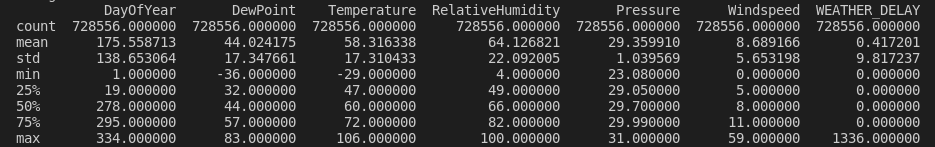
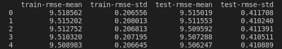

# Predicting Flight Delays with Weather Variables as Features Using Gradient Boosting

# Introduction

Business airlines are significant for the overall transportation
framework. Considerably after the greater part a time of standard
reception (particularly in the US), the passengers are so often troubled
via airline delays. On 2007, 23% of US flights were over 15 minutes late
to depart causing an aggregate cost of $32.9bn on the US \[1\].
Sub­optimal weather conditions were the direct cause of \~17% of those
delays, suggesting that better understanding of aircraft unfriendly
weather could improve airline scheduling and significantly reduce
delays. This project is intended to establish a model to predict flight
delays better than contemporary models.

# Related Works

There are many studies that attempt to model or predict flight delays
using data on origin, destination, time, and other non­weather features.
These investigations are commonly attempting to grandstand some new
theoretical work, and use flight postpone forecast as a model issue in
light of the fact that the dataset is broadly accessible, and the issue
is generally comprehended \[2, 3\].

Another, larger set of studies by economists and statisticians attempts
to understand weather’s impact on the flight system as a whole ­ how
congestion moves through the network, and how some schedules and routing
topologies (like ‘hub-­and-­spoke’) are more vulnerable to cascading
delays \[4, 5, 6\]. This project is having the purpose to be able to
predict weather related delay of a specific flight with greater accuracy
both for passengers who may adjust their schedule accordingly and
airline companies who may use this information for the betterment of
their financial model.

# Dataset and Features

The US Bureau of Transport Statistics provides data on all domestic
flights, including their scheduled and actual departure and takeoff
times, date, origin, destination, carrier, delay types and
classifications \[7\]. On the other hand, National Oceanic and
Atmospheric Administration (NOAA) provides various types of weather data
in various format and time delays. For this project’s purpose to be
served, Local Climatological Data (LCD) was best suited for its hourly
interval and data being available from more than 1,600 US land-based
weather stations. For this project to work, these two major datasets
were to be combined and that was not a simple undertaking.

## Datasets

1.  Reporting Carrier On-Time Performance Dataset

	The US Bureau of Transport Statistics provides a webtool \[7\] to
	download this dataset with custom fields and period. Data for 2017 was
	downloaded from the webpage with FlightDate, CRSDepTime, Origin and
	WeatheDelay fields.

2.  Local Climatological Data (LCD)

	Local Climatological Data (LCD) hourly, daily, and monthly data for
	around 1,600 U.S. locations. Only hourly observations were useful for
	this project. NOAA also provides a webtool to download this dataset for
	a certain period of certain stations. The data collection process is
	described in later sections. WBAN, Date, Time, Dry Bulb Temp, Wet Bulb
	Temperature, Dew Point Temperature, Relative Humidity, Wind Speed, 	Wind Direction, and Station Pressure were the fields of interest.

## Data Collection and Stitching

### Stitching Reporting Carrier On-Time Performance Data (RCOPD)

Reporting Carrier On-Time Performance Data is provided on monthly basis.
12 zip files were downloaded and unzipped into 12 Comma Separated Values
(CSV) files. Those files were merged into one file with a bash command.

    sed 1d \*\_ONTIME\_REPORTING\_2017\_\*.csv \> merged.csv

The Origin field of the merged.csv contains the call sign of the
airports the is collected from. But to join the data with NOAA LCD, a
common column was required. LCD Station metadata (lcd-station.txt) was
used here to map the Origin column to useful WBAN column. Python pandas
library utilized to used to perform this.

        import pandas as pd
    
    flight\_data = pd.read\_csv("merged.csv")
    
    station\_data = pd.read\_csv("lcd-stations.csv")
    
    flight\_with\_wban = pd.merge(flight\_data, station\_data, left\_on='ORIGIN', 
    
    right\_on='STATION', how='left')
    
    flight\_with\_wban.to\_csv("flight\_with\_wban.csv", index=False)

###  Collecting NOAA LCD Dataset

NOAA data download webtool doesn’t allow to download more than 10
stations data-year per order. So, a program was written using selenium
library for python to scrap their webpage and order the dataset with
less than 10 station for the year 2017. 19 orders were placed for 190
stations isolated from the RCOPD. These CSV files were also merged with
the similar bash command.

###  Stitching Datasets

Again, pandas library was used to merge the two datasets sorted on
DATETIME by WBAN field. unified.csv was the merged file that has all the
columns from both tables.

    import pandas as pd
    
    flight\_data = pd.read\_csv("unified/flight.csv")
    
    station\_data = pd.read\_csv("unified/weather.csv")
    
    flight\_data\['DATETIME'\] = pd.to\_datetime(flight\_data\['DATETIME'\])
    
    station\_data\['DATETIME'\] = pd.to\_datetime(station\_data\['DATETIME'\])
    
    merged = pd.merge\_asof(flight\_data.sort\_values('DATETIME'), 
    
    station\_data.sort\_values('DATETIME'), 
    
                            by='WBAN', 
    
                            on='DATETIME', 
    
                            allow\_exact\_matches=True, 
    
                            direction='nearest')
    
    merged.to\_csv("unified.csv", index=False)

unified.csv will be used as the final dataset all over the project.

# Feature Selection

Figure 1: Features VS WEATHER\_DELAY

MatPlotLib library has been used to plot the graphs on previous page to
explore the relation between different features and the target. From the
plots, it is clearly evident that, all the features other than
Visibility and WindDirection has a relationship with the target label
Weather\_Delay. So, those two features were dropped from the dataset.

    columns = \['Visibility', 'WindDirection'\]
    
    df.drop(columns, inplace=True, axis=1)
    
    df.to\_csv("dataset.csv", index=False)

  
Description of the features are following.

# Training the Model 

I built the model using Trees as base learners (which are the default base learners) using XGBoost's scikit-learn compatible API. Along the way, I also used some of the common tuning parameters included in XGBoost in order to improve the model's performance, and using the root mean squared error (RMSE) performance metric to check the performance of the trained model on the test set. Root mean Squared error is the square root of the mean of the squared differences between the actual and the predicted values. 

XGBoost is well known to provide better solutions than other machine
learning algorithms. In fact, since its inception, it has become the
"state-of-the-art” machine learning algorithm to deal with structured
data. XGBoost (Extreme Gradient Boosting) belongs to a family of
boosting algorithms and uses the gradient boosting (GBM) framework at
its core. It is an optimized distributed gradient boosting library.
Boosting is a sequential technique which works on the principle of an
ensemble. It combines a set of weak learners and delivers improved
prediction accuracy.

An 80%-20% ratio was maintained between training and test data. Target
value i.e., label and, independent variables, i.e., features are
differentiated. then converted the dataset into an optimized data
structure called Dmatrix that XGBoost supports and gives it acclaimed
performance and efficiency gains.

    data\_dmatrix = xgb.DMatrix(data=X,label=y)

The XGBoost regressor object was instantiated by calling the
XGBRegressor() class from the XGBoost library with the hyper-parameters
passed as arguments.

    xg\_reg = xgb.XGBRegressor(objective ='reg:squarederror', 
    
                             colsample\_bytree = 0.3, 
    
                             learning\_rate = 0.1, 
    
                             max\_depth = 5, 
    
                             alpha = 10,
    
                             n\_estimators = 10)

Then the regressor was fitted with training data.

    xg\_reg.fit(X\_train,y\_train)

And the prediction was achieved by using *predic* function.

    preds = xg\_reg.predict(X\_test)

# Result

Computed the RMSE by invoking the *mean\_sqaured\_error* function from
*sklearn's* metrics module.

    rmse = np.sqrt(mean\_squared\_error(y\_test, preds))

This will return the root mean square error of the test dataset. For
further validation, a k-fold cross validation was performed where all
the entries in the original training dataset are used for both training
as well as validation. Also, each entry is used for validation just
once.

    cv\_results = xgb.cv(dtrain=data\_dmatrix, 
    
                        params=params, 
    
                        nfold=3, 
    
                        num\_boost\_round=50,
    
                        early\_stopping\_rounds=10,
    
                        metrics="rmse", 
    
                        as\_pandas=True, 
    
                        seed=123)

*cv\_results* contain train and test RMSE metrics for each boosting
round. The following command will print 5 rows of the metrics.

    cv\_results.head()

As evident from the result, *train-rmse-mean* and *test-rmse-means* are
very close in value. So, it can be concluded that, it is a substantially
good predictive model.

# Discussion

Reporting Carrier On-Time Performance Data is offered from 1987. A more
accurate predictive model could be built using 1987 to present day data.
But due to lack of computation power, that was not an option for this
project. As weather variables are being used here as features, a
time-series analysis could prove to be yielding more accurate
prediction. Collecting and preprocessing 728 thousand rows of data was
extremely difficult for me here as a beginner in data mining. But the
outcome was satisfactory.

# Conclusion

Predicting flight delay not just has money related advantage, it
likewise can help individuals in their own life. Though lots of work has
been done in this field, modern data mining techniques can yield
surprising improvement in predictive modeling. My methodology was
adequate enough to prove that gradient boosting can help in flight delay
prediction with greater accuracy.

REFERENCES

\[1\] Guy, Ann Brody. “Flight delays cost $32.9 billion.”
http://news.berkeley.edu/2010/10/18/flight\_delays/

\[2\] Khanmohammadi, Sina, Salih Tutun, and Yunus Kucuk. "A New
Multilevel Input Layer Artificial Neural Network for Predicting Flight
Delays at JFK Airport." Procedia Computer Science 95 (2016): 237­244.

\[3\] Hensman, James, Nicolo Fusi, and Neil D. Lawrence. "Gaussian
processes for big data." CoRR, arXiv:1309.6835 (2013)

\[4\] Schaefer, Lisa, and David Millner. "Flight delay propagation
analysis with the detailed policy assessment tool." Systems, Man, and
Cybernetics, 2001 IEEE International Conference on. Vol. 2. IEEE, 2001.

\[5\] Hansen, Mark, and Chieh Hsiao. "Going south?: Econometric analysis
of US airline flight delays from 2000 to 2004." Transportation Research
Record: Journal of the Transportation Research Board 1915 (2005): 85­94.

\[6\] Gilbo, Eugene P. "Airport capacity: Representation, estimation,
optimization." IEEE Transactions on Control Systems Technology 1.3
(1993): 144­154.

\[7\] Anon. OST\_R: BTS: Transtats. Retrieved December 22, 2019 from
https://www.transtats.bts.gov/DL\_SelectFields.asp?DB\_Short\_Name=On-Time\&Table\_ID=236